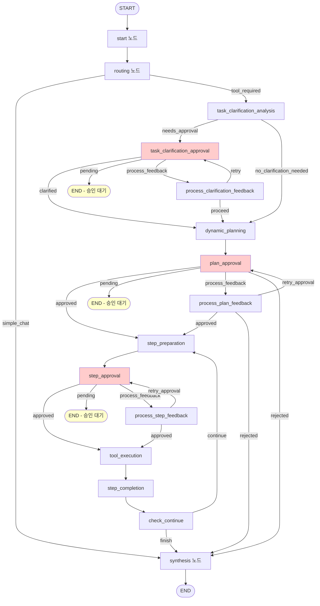

# LangGraph MCP Agent - Orchestrator Nodes Flow

## 📋 목차
1. [시스템 개요](#시스템-개요)
2. [초기화 프로세스](#초기화-프로세스)
3. [노드별 상세 플로우](#노드별-상세-플로우)
4. [메모리 시스템](#메모리-시스템)
5. [승인 시스템 (HITL)](#승인-시스템-hitl)
6. [도구 실행 메커니즘](#도구-실행-메커니즘)

---

## 🎯 시스템 개요

```
┌─────────────────────────────────────────────────────────────┐
│                    사용자 입력 (Query)                         │
└─────────────────────────────────────────────────────────────┘
                            ↓
┌─────────────────────────────────────────────────────────────┐
│                  LangGraphMCPAgent 초기화                     │
│  ┌───────────┐  ┌───────────┐  ┌──────────────┐             │
│  │ LLM Model │  │ MCP Tools │  │ BigTool Store│             │
│  └───────────┘  └───────────┘  └──────────────┘             │
│  ┌───────────────────────────────────────────┐              │
│  │ LangMem System (5개 Memory Managers)       │              │
│  │ - plan / tool / clarification / behavior  │               │
│  │ - workflow                                │               │
│  └───────────────────────────────────────────┘               │
└─────────────────────────────────────────────────────────────┘
                            ↓
┌─────────────────────────────────────────────────────────────┐
│              쿼리 복잡도 분석 (QueryAnalyzer)                    │
│         Simple Chat / Tool Required                          │
└─────────────────────────────────────────────────────────────┘
                            ↓
        ┌──────────────────┴──────────────────┐
        ↓                                      ↓
┌──────────────┐                    ┌─────────────────────┐
│ Simple Chat  │                    │ LangGraph Workflow  │
│ (LLM 직접)    │                    │ (Plan-and-ReAct)    │
└──────────────┘                    └─────────────────────┘
                                              ↓
                        ┌─────────────────────────────────┐
                        │  OrchestratorNodes 실행          │
                        │  1. Clarification (명확화)        │
                        │  2. Planning (계획 수립)          │
                        │  3. Step Execution (실행)        │
                        │  4. Synthesis (결과 종합)         │
                        └─────────────────────────────────┘
                                      ↓
                        ┌─────────────────────────────────┐
                        │  메모리 수집 (백그라운드)              │
                        │  - Plan / Tool / Behavior       │
                        │  - Clarification / Workflow     │
                        └─────────────────────────────────┘
                                      ↓
                        ┌─────────────────────────────────┐
                        │  최종 응답 스트리밍                  │
                        └─────────────────────────────────┘
```

### 핵심 구성 요소
- **LangGraph**: 상태 기반 워크플로우 오케스트레이션
- **BigTool**: 도구 추천 및 선택 시스템
- **ReAct Pattern**: 추론(Reasoning) + 행동(Action) 실행
- **LangMem**: 장기 메모리 관리 (PostgreSQL 기반)
- **HITL (Human-in-the-Loop)**: 사용자 승인 시스템

### 시스템 아키텍처
```
사용자 쿼리
    ↓
초기화 & 설정
    ↓
쿼리 복잡도 분석 (Routing)
    ↓
┌─────────────┬──────────────┐
│ Simple Chat │ Tool Required│
└─────────────┴──────────────┘
                    ↓
        작업 명확화 (Clarification)
                    ↓
        계획 수립 (Planning)
                    ↓
        단계별 실행 (Step Execution)
                    ↓
        결과 종합 (Synthesis)
```

---

## 🚀 초기화 프로세스

### 1. Agent 초기화 순서
```python
async def initialize():
    1. LLM 모델 설정 (GPT-5)
    2. Tool Bridge 연결
    3. BigTool 설정
       - 임베딩 모델 생성
       - InMemoryStore/PostgresStore 설정
       - 도구 메타데이터 인덱싱
    4. PostgreSQL 체크포인터 초기화
    5. LangMem 시스템 초기화
       - PostgresStore 생성 (memory_db)
       - 5개 Memory Managers 생성
         * plan (계획 개인화)
         * tool (도구 최적화)
         * clarification (명확화 패턴)
         * behavior (사용자 행동)
         * workflow (워크플로우 템플릿)
    6. Orchestrator Nodes 초기화
    7. LangGraph 워크플로우 컴파일
    8. Toolified Agents 설정 (선택적)
```

### 2. 그래프 컴파일
```python
def create_orchestrator_graph():
    # Interrupt 노드 결정 (HITL 설정)
    interrupt_nodes = _determine_interrupt_nodes()
    
    # 그래프 컴파일
    workflow.compile(
        checkpointer=self.memory,           # PostgreSQL
        interrupt_before=interrupt_nodes,   # 승인 지점
        store=self.shared_postgres_store    # LangMem
    )
```

---

## 📊 노드별 상세 플로우

```mermaid
graph TB
    Start([사용자 쿼리 입력]) --> Init[Agent 초기화]
    
    Init --> Setup1[LLM 모델 설정]
    Setup1 --> Setup2[Tool Bridge 연결]
    Setup2 --> Setup3[BigTool 설정]
    Setup3 --> Setup4[PostgreSQL 체크포인터]
    Setup4 --> Setup5[LangMem 초기화]
    Setup5 --> Setup6[그래프 컴파일]
    
    Setup6 --> Process[쿼리 처리 시작]
    
    Process --> Analyze{복잡도 분석}
    
    Analyze -->|Simple Chat| SimpleLLM[LLM 직접 응답]
    SimpleLLM --> End([응답 반환])
    
    Analyze -->|Tool Required| StartNode[start_node]
    
    StartNode --> Routing[routing_node복잡도 재확인]
    
    Routing --> Clarification{명확화 필요?}
    
    Clarification -->|Yes| ClarifyAnalysis[task_clarification_analysis]
    ClarifyAnalysis --> ClarifyApproval{승인 필요?}
    
    ClarifyApproval -->|Auto Apply| Planning
    ClarifyApproval -->|Approval Required| ClarifyWait[__interrupt__사용자 승인 대기]
    ClarifyWait --> ClarifyFeedback[process_clarification_feedback]
    ClarifyFeedback --> Planning
    
    Clarification -->|No| Planning[dynamic_planning단계별 계획 수립]
    
    Planning --> PlanApproval{계획 승인}
    
    PlanApproval -->|Auto| StepPrep
    PlanApproval -->|Approval Required| PlanWait[__interrupt__계획 승인 대기]
    PlanWait --> PlanFeedback[process_plan_feedback]
    PlanFeedback -->|Approved| StepPrep
    PlanFeedback -->|Edit| Planning
    PlanFeedback -->|Reject| Synthesis
    
    StepPrep[step_preparation단계 준비 & 도구 분석] --> StepApproval{단계 승인}
    
    StepApproval -->|Auto| ToolExec
    StepApproval -->|Approval Required| StepWait[__interrupt__단계 승인 대기]
    StepWait --> StepFeedback[process_step_feedback]
    StepFeedback -->|Approved| ToolExec
    StepFeedback -->|Edit| StepPrep
    StepFeedback -->|Skip| StepComplete
    
    ToolExec[tool_executionBigTool + ReAct 실행] --> StepComplete[step_completion]
    
    StepComplete --> Continue{다음 단계?}
    
    Continue -->|Yes| StepPrep
    Continue -->|No| Synthesis[synthesis최종 결과 종합]
    
    Synthesis --> SaveResult[결과 저장JSON/Markdown]
    SaveResult --> End
    
    style Init fill:#e1f5ff
    style Planning fill:#fff4e1
    style ToolExec fill:#e8f5e9
    style Synthesis fill:#f3e5f5
    style ClarifyWait fill:#ffebee
    style PlanWait fill:#ffebee
    style StepWait fill:#ffebee
    style End fill:#c8e6c9
```

<details>
<summary>Agent 워크플로우 다이어그램</summary>



</details>



### 3.1 노드 구조
```
START
  ↓
start (초기화)
  ↓
routing (복잡도 분석)
  ↓
┌────────────────────┬──────────────────┐
│   simple_chat      │  tool_required   │
└────────────────────┴──────────────────┘
                            ↓
              task_clarification_analysis
                            ↓
                   ┌────────┴────────┐
                   │    명확화 필요?    │
                   └────────┬────────┘
                  YES ↓           ↓ NO
       task_clarification_approval   │
                   ↓                 │
       process_clarification_feedback│
                   └────────┬────────┘
                            ↓
                   dynamic_planning
                            ↓
                     plan_approval
                            ↓
                  process_plan_feedback
                            ↓
        ┌────────────────────────────┐
        │   Step Execution Loop      │
        │   ┌──────────────────┐     │
        │   │ step_preparation │     │
        │   │       ↓          │     │
        │   │  step_approval   │     │
        │   │       ↓          │     │
        │   │ tool_execution   │     │
        │   │       ↓          │     │
        │   │ step_completion  │     │
        │   │       ↓          │     │
        │   │  check_continue  │     │
        │   └──────┬───────────┘     │
        │          ↓                 │
        │    계속? YES → 반복          │
        │          ↓ NO              │
        └──────────┴─────────────────┘
                   ↓
              synthesis (최종 결과 생성)
                   ↓
                  END
```

<details>
<summary><b>🔹 1. start_node</b> - 워크플로우 시작 및 초기 상태 설정</summary>

**목적**: 워크플로우 시작 및 초기 상태 설정

```python
async def start_node(state):
    # 세션 키 생성
    state['session_key'] = f"enhanced_bigtool_{timestamp}"
    state['start_time'] = current_time
    
    # 시작 이벤트 발송
    emit_event(MessageType.START, "처리 시작")
    
    return state
```

</details>

<details>
<summary><b>🔹 2. routing_node</b> - 쿼리 복잡도 분석 및 처리 경로 결정</summary>
**목적**: 쿼리 복잡도 분석 및 처리 경로 결정

```python
async def routing_node(state):
    # 복잡도 분석
    routing_decision = query_analyzer.analyze_query_complexity(query)
    
    # 결과
    # - SIMPLE_CHAT: 간단한 대화
    # - TOOL_REQUIRED: 도구 사용 필요
    
    # 히스토리 업데이트
    update_history_for_user_input(state, query, routing_type)
    
    return state
```

**분기 조건**:
- `simple_chat` → synthesis_node (LLM 직접 응답)
- `tool_required` → task_clarification_analysis_node

</details>

<details>
<summary><b>🔹 3. task_clarification_analysis_node</b> - 작업 명확화 필요성 분석 및 과거 패턴 재사용</summary>
**목적**: 작업 명확화 필요성 분석 및 과거 패턴 재사용

```python
async def task_clarification_analysis_node(state):
    # 1. 명확성 분석
    result = await task_clarifier.analyze_task_clarity(query)
    
    # 2. 메모리 검색 (과거 명확화 패턴)
    if langmem_enabled:
        past_clarifications = await langmem_managers['clarification'].asearch(
            query=normalized_query,
            config={"configurable": {"user_id": user_id}},
            limit=5
        )
        
        # 필터링 조건
        qualified = [
            p for p in past_clarifications
            if p.reuse_count >= threshold['min_reuse_count']
            and p.success_rate >= threshold['min_success_rate']
            and p.confidence >= threshold['min_confidence']
        ]
        
        # 자동 적용 판단
        if best['reuse_count'] >= 5 and best['confidence'] >= 0.9:
            # 자동 적용
            state['auto_clarification_applied'] = True
            state['_clarification_reused'] = True
            
            # 메모리 업데이트 알림
            send_consolidation_message(...)
            
            return state  # → dynamic_planning
    
    # 3. 명확화 필요 여부 결정
    if needs_clarification:
        state['_needs_clarification_approval'] = True
        state['clarification_questions'] = questions
        state['past_clarification_examples'] = examples
    
    return state
```

**라우팅**:
- `needs_approval` → task_clarification_approval_node
- `no_clarification_needed` → dynamic_planning_node

</details>

<details>
<summary><b>🔹 4. task_clarification_approval_node</b> - 명확화 승인 대기 (Interrupt 지점)</summary>
**목적**: 명확화 승인 대기 (Interrupt 지점)

```python
async def task_clarification_approval_node(state):
    # HITL 비활성화 체크
    if not enable_clarification_approval:
        return approve_automatically()
    
    # 중복 방지
    if already_clarified or already_sent or user_action_pending:
        return state
    
    # 승인 대기 상태 설정
    state['approval_pending'] = True
    state['approval_type'] = 'task_clarification'
    state['_clarification_approval_sent'] = True
    
    # Interrupt 발생 → 사용자 입력 대기
    return state
```

**Interrupt 후 사용자 액션**:
- `clarify` → process_clarification_feedback_node
- `proceed_anyway` → process_clarification_feedback_node
- `reuse_past` → process_clarification_feedback_node

</details>

<details>
<summary><b>🔹 5. process_clarification_feedback_node</b> - 명확화 피드백 처리 및 메모리 저장</summary>
**목적**: 명확화 피드백 처리 및 메모리 저장

```python
async def process_clarification_feedback_node(state):
    user_action = state.get('user_action')
    clarification_response = state.get('clarification_response')
    
    # === 1. clarify 액션 (직접 입력) ===
    if user_action == "clarify":
        # 쿼리 병합
        enhanced_query = f"{original_query}\n\n추가 정보: {response}"
        
        # 개선도 측정
        improvement = await measure_clarification_improvement(
            original_query, enhanced_query
        )
        
        # 메모리 저장
        if langmem_enabled:
            # 중복 체크
            should_save = check_for_duplicates(...)
            
            if should_save:
                # 통합 메시지 전송
                unified_message = """
                SINGLE Clarification Session Record:
                
                query_semantic_context: {normalized_query}
                task_semantic_context: {session_id}
                semantic_domain_id: {domain_id}
                
                User's Complete Response: {response}
                
                Session Metrics:
                - Clarity Before: {before_conf}
                - Clarity After: {after_conf}
                - Improvement: {improvement}
                
                CONSOLIDATION: Store as SINGLE entry
                """
                
                await langmem_managers['clarification'].ainvoke(...)
        
        state['_clarification_saved'] = True
    
    # === 2. proceed_anyway 액션 (과거 패턴 재사용) ===
    elif user_action == "proceed_anyway":
        # 과거 응답 병합
        enhanced_query = f"{original_query}\n\n과거 이력: {response}"
        
        # 재사용 알림 메시지
        reuse_message = """
        REUSE notification:
        
        query_semantic_context: {normalized_query}
        Selected Response: {response}
        
        CONSOLIDATION: INCREMENT reuse_count by 1
        """
        
        await langmem_managers['clarification'].ainvoke(...)
        
        state['_clarification_reused'] = True
    
    # 상태 업데이트
    state['task_clarified'] = True
    state['approval_pending'] = False
    
    return state
```

</details>

<details>
<summary><b>🔹 6. dynamic_planning_node</b> - 계획 수립 및 메모리 기반 개인화</summary>
**목적**: 계획 수립 및 메모리 기반 개인화

```python
async def dynamic_planning_node(state):
    # 1. 컨텍스트 구성
    context_messages = get_context_for_llm(state)
    
    # 2. 초기 계획 생성
    plan = await planner.ainvoke({"messages": [planning_input]})
    state['plan'] = plan.steps
    state['original_plan'] = plan.steps.copy()
    
    # 3. 메모리 기반 개인화
    if langmem_enabled:
        personalization = await _personalize_plan_with_langmem(
            user_id, query, initial_plan
        )
        
        if personalization:
            # 과거 패턴 검색
            similar_patterns = await langmem_managers['plan'].asearch(
                query=normalized_query,
                config={"configurable": {"user_id": user_id}},
                limit=5
            )
            
            # 필터링
            qualified = filter_by_similarity_and_success(patterns)
            
            # LLM에 개선 요청
            improvement_prompt = """
            Initial Plan: {initial_plan}
            Past Successful Patterns: {patterns}
            
            YOUR TASK: Optimize the plan based on patterns
            """
            
            result = await model.ainvoke(improvement_prompt)
            
            # 신뢰도 조정 (Cold Start 완화)
            confidence_multiplier = calculate_confidence_multiplier(
                sample_count
            )
            adjusted_confidence = raw * (0.7 + 0.3 * multiplier)
            
            if adjusted_confidence > threshold:
                state['plan'] = result['improved_plan']
                state['personalization_applied'] = result['applied_patterns']
    
    # 4. 파일 저장
    await save_plan_to_file(plan, metadata)
    
    return state
```

</details>

<details>
<summary><b>🔹 7. plan_approval_node</b> - 계획 승인 대기 (Interrupt 지점)</summary>
**목적**: 계획 승인 대기 (Interrupt 지점)

```python
async def plan_approval_node(state):
    # HITL 비활성화 체크
    if not enable_plan_approval:
        return approve_automatically()
    
    # 중복 방지
    if already_approved or no_plan or already_sent:
        return state
    
    # 승인 대기 상태
    state['approval_pending'] = True
    state['approval_type'] = 'plan_approval'
    
    # Interrupt 발생
    return state
```

**사용자 액션**:
- `accept` → process_plan_feedback_node
- `edit` → process_plan_feedback_node
- `reject` → synthesis_node

</details>

<details>
<summary><b>🔹 8. process_plan_feedback_node</b> - 계획 피드백 처리</summary>
**목적**: 계획 피드백 처리

```python
async def process_plan_feedback_node(state):
    user_action = state['user_action']
    
    # === Edit 처리 ===
    if action == 'edit':
        edited_plan = parse_edited_plan(edited_content)
        
        state['plan'] = edited_plan
        state['plan_edited'] = True
        state['plan_approved'] = True      # 자동 승인
        state['approval_pending'] = False
    
    # === Accept 처리 ===
    elif action == 'accept':
        state['plan_approved'] = True
        state['approval_pending'] = False
    
    # === Reject 처리 ===
    elif action == 'reject':
        state['workflow_rejected'] = True
        state['approval_pending'] = False
    
    # 히스토리 업데이트
    state['approval_history'].append({
        "action": action,
        "timestamp": now(),
        "approval_type": "plan_approval"
    })
    
    return state
```

</details>

<details>
<summary><b>🔹 9. step_preparation_node</b> - 단계 실행 준비 및 도구 분석</summary>
**목적**: 단계 실행 준비 및 도구 분석

```python
async def step_preparation_node(state):
    step_desc = state['plan'][current_step_index]
    
    # === 모드 분기: HITL 활성화 여부 ===
    enable_step_approval = state.get('enable_step_approval', False)
    
    # 1. BigTool 도구 추천 (항상)
    recommendations = bigtool_recommender(step_desc, limit=5)
    
    if not enable_step_approval:
        # === 경량 모드: 스키마 분석 없음 ===
        if langmem_enabled:
            # 메모리 최적화 (필터링/재정렬만)
            optimized = await optimize_tools_lightweight(
                user_id, step_desc, recommendations
            )
            
            state['execution_tools'] = optimized['execution_tools']
        else:
            state['execution_tools'] = [rec.name for rec in recommendations[:5]]
    
    else:
        # === 상세 모드: 전체 스키마 분석 ===
        # 2. 각 도구별 스키마 추출
        tools_analysis = await analyze_multiple_tools(recommendations, step_desc)
        
        for tool in top_5_tools:
            # Pydantic 스키마 → 사용자 친화적 스키마
            user_friendly_schema = convert_to_user_friendly(tool.schema)
            
            # LLM으로 파라미터 생성
            generated_params = await generate_parameters_with_schema(
                tool, step_desc, user_friendly_schema
            )
            
            # 필수 필드 검증
            missing_fields = check_missing_required_fields(tool, params)
            
            # 준비도 점수 계산
            readiness_score = (total - missing) / total
        
        # 3. 메모리 최적화 (상세)
        if langmem_enabled:
            tools_analysis = await apply_memory_optimization_detailed(
                tools_analysis, step_desc, user_id
            )
            
            # 과거 패턴 검색
            tool_patterns = await langmem_managers['tool'].asearch(
                query=step_desc,
                config={"configurable": {"user_id": user_id}},
                limit=10
            )
            
            # 성공/회피 맵 구성
            for pattern in tool_patterns:
                if pattern.success:
                    success_map[tool_name] = {
                        'score_boost': pattern.success_rate * 0.3,
                        'optimal_params': pattern.optimal_parameters
                    }
                elif pattern.should_avoid:
                    avoid_set.add(tool_name)
            
            # 도구 재정렬
            optimized_tools = rerank_with_memory(tools_analysis, success_map, avoid_set)
        
        # 4. 주요 도구 정보 저장
        state['recommended_tool_info'] = {
            "tool_name": primary_tool.name,
            "user_friendly_schema": schema,
            "generated_params": params,
            "missing_fields": missing,
            "memory_optimized": True
        }
        
        state['execution_tools'] = [t.name for t in optimized_tools]
    
    return state
```

</details>

<details>
<summary><b>🔹 10. step_approval_node</b> - 단계 승인 대기 (Interrupt 지점)</summary>
**목적**: 단계 승인 대기 (Interrupt 지점)

```python
async def step_approval_node(state):
    # HITL 비활성화 체크
    if not enable_step_approval:
        return approve_automatically()
    
    # 행동 예측 (메모리 기반)
    if langmem_enabled:
        prediction = await predict_user_behavior(
            user_id, step_desc, tool_name
        )
        
        # 높은 확률로 accept 예상 시 자동 승인
        if prediction.accept_probability > 0.8:
            state['current_step_approved'] = True
            state['auto_approved_by_prediction'] = True
            return state
    
    # 승인 대기
    state['approval_pending'] = True
    state['approval_type'] = 'step_approval'
    
    return state
```

</details>

<details>
<summary><b>🔹 11. process_step_feedback_node</b> - 단계 피드백 처리</summary>
**목적**: 단계 피드백 처리

```python
async def process_step_feedback_node(state):
    user_action = state['user_action']
    
    # === Edit 처리 ===
    if action == 'edit':
        # 스키마 기반 파라미터 수정
        user_friendly_schema = state['recommended_tool_info']['schema']
        parsed_params = parse_user_edited_parameters_with_schema(
            edited_content, user_friendly_schema
        )
        
        # 파라미터 업데이트
        current_params.update(parsed_params)
        state['llm_generated_params'] = current_params
        
        # 필수 필드 재검증
        updated_missing = check_missing_required_fields(tool, current_params)
        state['missing_required_fields'] = updated_missing
        
        # 승인 완료
        state['current_step_approved'] = True
        state['approval_pending'] = False
    
    # === Accept 처리 ===
    elif action == 'accept':
        state['current_step_approved'] = True
        state['approval_pending'] = False
    
    # === Skip 처리 ===
    elif action == 'skip':
        state['current_step_skipped'] = True
        state['current_step_approved'] = True
        state['approval_pending'] = False
    
    # 피드백 패턴 임시 저장 (synthesis에서 메모리 저장)
    if langmem_enabled:
        feedback_pattern = {
            'step_description': step_desc,
            'tool_used': tool_name,
            'user_action': action,
            'response_time': response_time,
            'edit_content': edited_content
        }
        state['temp_feedback_patterns'].append(feedback_pattern)
    
    return state
```

</details>

<details>
<summary><b>🔹 12. tool_execution_node</b> - BigTool + ReAct 패턴 실행</summary>
**목적**: BigTool + ReAct 패턴 실행

```python
async def tool_execution_node(state):
    # 자동 도구 감지 (선택적)
    if auto_tool_detection:
        tools_updated = await check_and_update_tools()
    
    # === Skip 처리 ===
    if state.get('current_step_skipped'):
        state['tool_execution_status'] = "skipped"
        state['current_tool_result'] = "건너뛴 단계"
        return state
    
    # === 하이브리드 실행 ===
    # 1. 추천 도구 분석 (BigTool)
    recommended_tools = state.get('execution_tools', [])
    generated_params = state.get('llm_generated_params', {})
    
    # 2. ReAct 패턴 실행
    execution_success, method = await tool_executor.execute_hybrid_react(
        state, event_manager, step_num, step_desc
    )
    
    # execute_hybrid_react 내부:
    """
    if recommended_tools and generated_params:
        # 인간 힌트 활용 시도
        try_guided_execution_with_hints()
    
    # 힌트 실패 or 없음 → 완전 자율 ReAct
    react_result = await react_agent.ainvoke(
        {
            "messages": [
                SystemMessage(context),
                HumanMessage(step_desc)
            ]
        },
        config={"configurable": {"thread_id": chat_id}}
    )
    
    # 결과 추출
    extract_tools_and_results(react_result)
    """
    
    # 3. 결과 저장
    state['current_tool_used'] = tools_used
    state['current_tool_result'] = result
    state['tool_execution_status'] = "success"
    
    return state
```

</details>

<details>
<summary><b>🔹 13. step_completion_node</b> - 단계 완료 및 파일 저장</summary>
**목적**: 단계 완료 및 파일 저장

```python
async def step_completion_node(state):
    step_id = f"step_{current_step_index + 1}"
    
    # === 도구 실행 검증 ===
    tool_result = state['current_tool_result']
    tool_actually_succeeded = is_tool_call_successful(tool_result)
    
    # 성공 판단 로직
    final_success = (
        status_success AND
        tool_actually_succeeded AND
        validation_passed
    )
    
    # === Skip 처리 ===
    if state.get('current_step_skipped'):
        state['subtask_results'][step_id] = {
            "success": False,
            "result": "건너뛴 단계",
            "execution_status": "skipped",
            "skipped_by_user": True
        }
    
    # === 정상 실행 ===
    else:
        failure_reason = extract_failure_reason(tool_result) if not succeeded
        
        state['subtask_results'][step_id] = {
            "success": final_success,
            "tool_validation_passed": tool_actually_succeeded,
            "result": tool_result[:500],
            "full_result": tool_result,
            "tools_used": [state['current_tool_used']],
            "execution_time_seconds": execution_time,
            "failure_reason": failure_reason,
            "completed_at": now()
        }
    
    # === 강제 파일 저장 ===
    try:
        if file_manager:
            filename = f"step_{step_num:02d}_{status}_forced.json"
            json_path, md_path = file_manager.save_file(
                FileType.SUBTASK_RESULT,
                filename,
                step_result_data
            )
        else:
            # Fallback 저장
            direct_save_to_disk(step_result_data)
    
    except:
        # 최후의 수단
        fallback_save_to_txt(step_result_data)
    
    # 다음 단계로 이동
    state['current_step_index'] += 1
    
    return state
```

**도구 실행 검증 함수**:
```python
def is_tool_call_successful(tool_result: str) -> bool:
    # 에러 패턴 체크
    error_patterns = [
        "input validation error",
        "iserror\": true",
        "400 bad request",
        "500 internal server error",
        "tool execution failed"
    ]
    
    # JSON 에러 체크
    if json_data.get('isError') is True:
        return False
    
    # 성공 지표 확인
    success_indicators = ["successfully", "completed", "found"]
    
    return no_errors and sufficient_length
```

</details>

<details>
<summary><b>🔹 14. check_continue_node</b> - 실행 진행 상황 체크</summary>
**목적**: 실행 진행 상황 체크

```python
async def check_continue_node(state):
    completed = state['current_step_index']
    total = len(state['plan'])
    
    # 실행 통계 업데이트
    state['execution_stats'].update({
        "total_steps": total,
        "completed_steps": completed,
        "success_steps": count_successful(),
        "failed_steps": count_failed(),
        "completion_percentage": (completed / total * 100),
        "validation_success_rate": calculate_validation_rate()
    })
    
    # 진행 상황 이벤트
    emit_event(MessageType.STATUS, f"{completed}/{total} 완료")
    
    return state
```

**라우팅**:
- `continue` → step_preparation_node
- `finish` → synthesis_node

</details>

<details>
<summary><b>🔹 15. synthesis_node</b> - 최종 결과 종합 및 메모리 수집</summary>
**목적**: 최종 결과 종합 및 메모리 수집

```python
async def synthesis_node(state):
    routing_type = state['routing_decision']['complexity']
    
    # === Simple Chat ===
    if routing_type == 'SIMPLE_CHAT':
        chat_input = get_context_string_for_llm(
            state, "simple_chat", query,
            personal_context=personal_context,
            domain_context=domain_context
        )
        
        response = await model.ainvoke([HumanMessage(chat_input)])
        final_result = response.content
        
        # 히스토리 추가
        add_assistant_message(state, final_result)
        
        # 파일 저장
        save_final_result_to_file(final_result, stats)
    
    # === Complex Tool ===
    else:
        subtask_results = state['subtask_results']
        
        successful_results = filter_successful(subtask_results)
        failed_results = filter_failed(subtask_results)
        skipped_results = filter_skipped(subtask_results)
        
        # LLM 기반 종합
        if len(successful_results) >= 1:
            final_result = await synthesize_results_with_llm(
                personal_context,
                domain_context,
                query,
                successful_results,
                skipped_results
            )
        
        # 히스토리 추가
        add_assistant_message(state, final_result)
        
        # 실행 통계 업데이트
        enhanced_stats = {
            "final_result_length": len(final_result),
            "overall_success": len(successful_results) > 0,
            "success_rate": len(successful) / len(total) * 100,
            "total_subtasks": len(subtask_results),
            "validation_errors_count": len(validation_errors)
        }
        
        # 파일 저장
        save_final_result_to_file(final_result, enhanced_stats)
        
        # === 백그라운드 메모리 수집 (완전 비차단) ===
        if langmem_enabled:
            state_snapshot = create_state_snapshot(state)
            
            # Fire-and-forget
            asyncio.create_task(
                safe_memory_collection_background(
                    state_snapshot,
                    enhanced_stats
                )
            )
    
    # 최종 이벤트
    emit_event(MessageType.TOKEN, final_result)
    emit_event(MessageType.END, "처리 완료")
    
    return state
```

</details>

## 🧠 메모리 시스템

### LangMem 아키텍처
```
PostgreSQL (memory_db)
    ↓
PostgresStore (임베딩 + 벡터 검색)
    ↓
5개 Memory Managers
    - plan: 계획 개인화
    - tool: 도구 최적화
    - clarification: 명확화 패턴
    - behavior: 사용자 행동
    - workflow: 워크플로우 템플릿
```

### 메모리 수집 프로세스

#### 1. Plan Memory
```python
async def _collect_plan_memory(state, stats, user_id):
    # 중복 체크
    existing_patterns = await langmem_managers['plan'].asearch(...)
    
    for pattern in existing_patterns:
        if same_query_and_plan(pattern, current):
            # 업데이트만
            send_update_message("INCREMENT success_count")
            return
    
    # 새 패턴 저장
    plan_message = """
    CONSOLIDATION REQUEST:
    
    query_semantic_context: {normalized_query}
    task_semantic_context: {workflow_pattern}
    
    Plan Details:
    - Original Plan: {original_plan}
    - Final Plan: {final_plan}
    - Was Edited: {was_edited}
    - Success Rate: {success_rate}
    
    SEARCH: Use query_semantic_context as PRIMARY
    CONSOLIDATE: Merge similar patterns, increment counters
    """
    
    await langmem_managers['plan'].ainvoke(...)
```

#### 2. Tool Memory
```python
async def _collect_tool_memory(state, stats, user_id):
    for step_result in subtask_results:
        tools_used = step_result['tools_used']
        
        for tool_name in tools_used:
            tool_message = """
            Tool Usage Record:
            
            query_semantic_context: {normalized_query}
            task_semantic_context: {step_description}
            
            Tool: {tool_name}
            Success: {is_success}
            Execution Time: {execution_time}
            
            CONSOLIDATION:
            1. Search by task_semantic_context (PRIMARY)
            2. If exists and success=True: increment success_count
            3. If exists and success=False: increment failure_count
            4. Update avg_execution_time, success_rate
            5. Consider should_avoid if failure_count > 2
            """
            
            await langmem_managers['tool'].ainvoke(...)
```

#### 3. Clarification Memory
```python
# process_clarification_feedback_node에서 즉시 저장
async def process_clarification_feedback_node(state):
    if user_action == "clarify":
        # 개선도 측정
        improvement = await measure_clarification_improvement(...)
        
        # 통합 메시지
        unified_message = """
        SINGLE Clarification Session:
        
        query_semantic_context: {normalized_query}
        task_semantic_context: {session_id}
        semantic_domain_id: {domain_id}
        
        User Response: {full_response}
        
        Metrics:
        - Clarity Before: {before}
        - Clarity After: {after}
        - Improvement: {improvement}
        
        CONSOLIDATION: Store as SINGLE entry per session
        """
        
        await langmem_managers['clarification'].ainvoke(...)
        
        state['_clarification_saved'] = True  # 중복 방지
```

#### 4. Behavior Memory
```python
async def _collect_behavior_memory(state, stats, user_id):
    approval_history = state['approval_history']
    
    actions = [h['action'] for h in history]
    avg_time = calculate_avg_response_time(history)
    edit_freq = actions.count('edit') / len(actions)
    skip_freq = actions.count('skip') / len(actions)
    
    behavior_message = """
    User Behavior Pattern:
    
    query_semantic_context: {normalized_query}
    task_semantic_context: {approval_context}
    
    Data:
    - Actions: {actions}
    - Avg Response Time: {avg_time}
    - Edit Frequency: {edit_freq}
    - Skip Frequency: {skip_freq}
    
    SEARCH: Use task_semantic_context for prediction
    """
    
    await langmem_managers['behavior'].ainvoke(...)
```

#### 5. Workflow Memory
```python
async def _collect_workflow_memory(state, stats, user_id):
    plan = state['plan']
    tool_sequence = extract_tool_sequence(subtask_results)
    category = categorize_query(query)
    
    workflow_message = """
    Workflow Summary:
    
    query_semantic_context: {normalized_query}  # PRIMARY
    task_semantic_context: {workflow_pattern}
    
    Details:
    - Category: {category}
    - Plan: {plan}
    - Tools: {tool_sequence}
    - Success Rate: {success_rate}
    
    SEARCH: Use query_semantic_context for template matching
    """
    
    await langmem_managers['workflow'].ainvoke(...)
```

### Cold Start 완화
```python
def calculate_confidence_multiplier(sample_count: int) -> float:
    """샘플 수에 따른 신뢰도 배수"""
    if sample_count >= 5:
        return 1.0   # 충분한 데이터
    elif sample_count >= 3:
        return 0.7   # 적당한 데이터
    elif sample_count >= 2:
        return 0.5   # 적은 데이터
    elif sample_count >= 1:
        return 0.3   # 매우 적은 데이터
    else:
        return 0.0   # 데이터 없음

# 사용 예시
adjusted_confidence = raw_confidence * (0.7 + 0.3 * multiplier)
```

---

## 🤝 승인 시스템 (HITL)

### 설정 방식
```python
# 환경 변수
ENABLE_HITL = True  # 전역 스위치

# 개별 제어
ENABLE_CLARIFICATION_APPROVAL = True
ENABLE_PLAN_APPROVAL = True
ENABLE_STEP_APPROVAL = False  # 경량 모드
```

### Interrupt 노드 결정
```python
def _determine_interrupt_nodes() -> List[str]:
    interrupt_nodes = []
    
    # 개별 설정 우선
    if ENABLE_CLARIFICATION_APPROVAL:
        interrupt_nodes.append("task_clarification_approval")
    
    if ENABLE_PLAN_APPROVAL:
        interrupt_nodes.append("plan_approval")
    
    if ENABLE_STEP_APPROVAL:
        interrupt_nodes.append("step_approval")
    
    # 개별 설정 없고 전역만 있으면 모두 활성화
    if not interrupt_nodes and ENABLE_HITL:
        interrupt_nodes = [
            "task_clarification_approval",
            "plan_approval",
            "step_approval"
        ]
    
    return interrupt_nodes
```

### 승인 플로우
```
1. Approval 노드 도달
    ↓
2. approval_pending = True 설정
    ↓
3. Interrupt 발생 (LangGraph)
    ↓
4. HUMAN_INPUT_REQUIRED 이벤트 발송
    ↓
5. 사용자 입력 대기
    ↓
6. POST /approve/{chat_id} 요청
    ↓
7. State 업데이트 (user_action, edited_content)
    ↓
8. update_state() 호출 → 그래프 재개
    ↓
9. process_*_feedback_node 실행
    ↓
10. approval_pending = False 설정
    ↓
11. 다음 노드로 진행
```

---

## 🔧 도구 실행 메커니즘

### BigTool 추천 시스템
```python
# 도구 인덱싱
await _index_tools_with_embeddings(bigtool_store, tool_registry)

# 추천 함수
def recommend_tools(query: str, limit: int = 5):
    # 벡터 검색
    if use_postgres_store:
        results = postgres_manager.with_store(
            lambda store: store.search(("tools",), query=query, limit=limit)
        )
    else:
        results = bigtool_store.search(("tools",), query=query, limit=limit)
    
    # 도구 객체 반환
    recommendations = [
        {
            "tool": tool_registry[result.key],
            "tool_name": result.key,
            "score": result.score
        }
        for result in results
    ]
    
    return recommendations
```

### 자동 도구 감지
```python
async def check_and_update_tools_before_execution():
    current_time = time.time()
    
    # 체크 간격 확인
    if (current_time - last_check) < check_interval:
        return False
    
    # MCP Hub에서 최신 도구 목록
    current_tools = await mcp_client.get_tools()
    
    # 해시 기반 변경 감지
    current_hash = hash(tuple(sorted([t.name for t in current_tools])))
    
    if tools_hash == current_hash:
        return False
    
    # 신규/제거 도구 감지
    new_tools = current_tools_set - existing_tools_set
    removed_tools = existing_tools_set - current_tools_set
    
    if new_tools or removed_tools:
        # 도구 목록 업데이트
        self.tools = current_tools
        self.tool_registry = {t.name: t for t in current_tools}
        
        # BigTool 스토어 증분 업데이트
        await update_bigtool_store_incrementally(new_tools, removed_tools)
        
        # ReAct 에이전트 재생성
        self.react_agent = create_react_agent(model, tools)
        
        # Tool Executor 업데이트
        self.tool_executor.tools = self.tools
        self.tool_executor.react_agent = self.react_agent
        
        return True
```

---

## 📝 컨텍스트 관리

### 히스토리 관리
```python
class ConversationHistoryManager:
    # 새 태스크 마커
    NEW_TASK_MARKER = "\n\n=== NEW TASK ===\n\n"
    
    @staticmethod
    def update_history_for_user_input(state, query, routing_type):
        messages = state.get('messages', [])
        
        # Simple Chat: 그대로 추가
        if routing_type == 'simple_chat':
            messages.append(HumanMessage(content=query))
        
        # Tool Required: 마커 추가
        else:
            enhanced_query = f"{NEW_TASK_MARKER}{query}"
            messages.append(HumanMessage(content=enhanced_query))
        
        state['messages'] = messages
        return state
    
    @staticmethod
    def add_assistant_message(state, response):
        messages = state.get('messages', [])
        messages.append(AIMessage(content=response))
        state['messages'] = messages
        return state
```

### LLM 컨텍스트 구성
```python
def get_context_string_for_llm(state, routing_type, current_query,
                                personal_context="", domain_context=""):
    messages = state.get('messages', [])
    
    # 최근 N개만 선택
    recent_messages = messages[-10:] if len(messages) > 10 else messages
    
    # System 프롬프트
    system_prompt = f"""
    당신은 도움을 주는 AI 어시스턴트입니다.
    
    유저 정보:
    {personal_context}
    
    도메인 지식:
    {domain_context}
    """
    
    # 히스토리 포맷팅
    history_text = ""
    for msg in recent_messages:
        if isinstance(msg, HumanMessage):
            clean_content = msg.content.replace(NEW_TASK_MARKER, "")
            history_text += f"Human: {clean_content}\n\n"
        elif isinstance(msg, AIMessage):
            history_text += f"Assistant: {msg.content}\n\n"
    
    # 최종 조합
    full_context = f"{system_prompt}\n\n{history_text}Human: {current_query}"
    
    return full_context
```

---

## 🎉 주요 특징 요약

### ✅ 강점
1. **개인화**: LangMem 기반 과거 패턴 학습 및 재사용
2. **검증**: 도구 실행 결과 실제 검증 (`isError` 체크)
3. **유연성**: HITL 개별 제어, Cold Start 완화
4. **확장성**: 자동 도구 감지, 동적 도구 추가/제거
5. **투명성**: 상세한 로깅, 파일 저장, 이벤트 스트리밍
6. **안정성**: 강제 파일 저장, Fallback 메커니즘

### 🔧 최적화 포인트
1. **경량/상세 모드**: HITL 비활성화 시 스키마 분석 생략
2. **백그라운드 메모리 수집**: Fire-and-forget으로 응답 속도 향상
3. **캐싱**: 도메인 서명, 도구 임베딩 캐싱
4. **증분 업데이트**: 도구 목록 변경 시 전체 재인덱싱 대신 증분 업데이트

---

## 📚 참고 자료

### 핵심 의존성
- **LangGraph**: 상태 기반 워크플로우
- **LangChain**: LLM 체인, 도구 통합
- **PostgreSQL**: 체크포인터, 메모리 저장
- **LangMem**: 장기 메모리 관리
- **BigTool**: 도구 추천 시스템

### 환경 변수
```bash
# LLM
OPENAI_GPT5_DEPLOYMENT=gpt-5-preview
OPENAI_GPT5_ENDPOINT=https://...
OPENAI_GPT5_API_KEY=sk-...

# PostgreSQL
POSTGRES_HOST=localhost
POSTGRES_PORT=5432
POSTGRES_USER=postgres
POSTGRES_PASSWORD=password

# HITL
ENABLE_HITL=true
ENABLE_CLARIFICATION_APPROVAL=true
ENABLE_PLAN_APPROVAL=true
ENABLE_STEP_APPROVAL=false

# Tool Detection
AUTO_TOOL_DETECTION=true
TOOL_CHECK_INTERVAL=300

# LangMem
ENABLE_LKM_MEMORY=true
```

---

**버전**: 1.0.0  
**최종 업데이트**: 2025-01-21  
**작성자**: AI System Documentation
